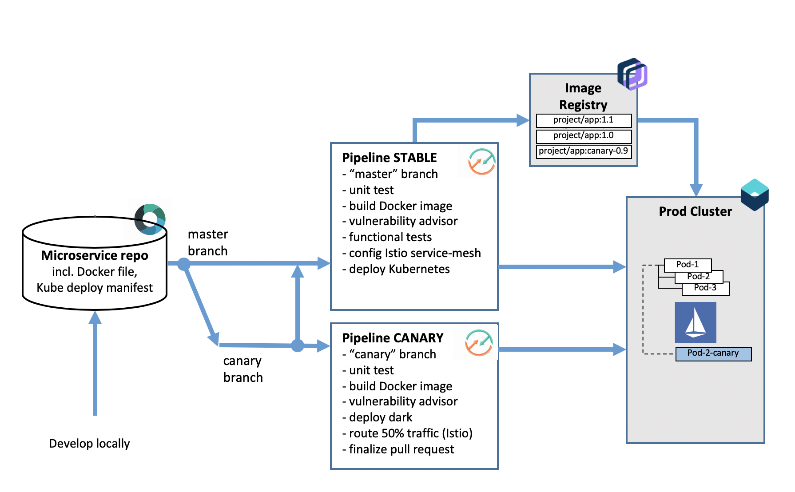

#  Canary testing in Kubernetes using Istio

### Develop and canary test your Kubernetes application using Istio

This DevOps process illustrates how to use a parallel Git branch (canary) to develop a new version of an application, letting the pipelines drive the canary rollout using Istio features. In particular, the process is automatically inferring the Kubernetes deployment manifest to drive Istio routing without needed developer to intervene and maintain separate copies of these.

The sample application is using Docker and Go and is adapted from [guestbook](https://github.com/IBM/guestbook). It includes a DevOps toolchain that is preconfigured for canary testing (branch 'canary'), continuous delivery with Vulnerability Advisor, source control, issue tracking, and online editing, and deployment to the IBM Cloud Kubernetes Service.

Application code is stored in source control, along with its Dockerfile and its Kubernetes deployment script.
The target cluster is configured during toolchain setup (using an IBM Cloud API key and cluster name). You can later change these by modifying the Delivery Pipeline configuration.
Any code change to the master branch in the Git repo will automatically be built, validated and deployed into the Kubernetes cluster.

Changes to the `canary` branch will be rolled out in parallel, leveraging istio traffic management abilitiy.

### To get started, click this button:

### Steps

Learn how to canary test an application using Istio using 2 branches: 
* master for mainstream development and rollout of new versions (or emergency fixes)
* canary branch for A/B testing a long lasting feature branch.

* At the beginning of the scenario, you have master pipeline deploy to prod with application "v1".
* View the `stable` pipeline execution, find the deployed application (log in deploy stage) 
* Switch to developing feature in canary branch. Canary branch is already up in repo, with a tiny code change (just updated header to "v2"), but could further enhance it at will.
* Deploy the canary by triggering the `canary` pipeline. Will build and deploy the application in parallel of the master one, modifying the deployment manifests automatically, without needing developer to manage multiple versions, and configuring Istio routing rules for user (visible in the logs)
* Dark deployment is configuring the routing to only expose the canary app to Firefox users, next stage deploy is exposing the canary to 50% user.
* Once happy with the new behavior, create a pull request from canary->master, run the last stage (finalize) to collapse the canary launch, as the feature got merged into the master branch and redeployed properly.

---
### Learn more 

* Blog [Continuously deliver your app to Kubernetes with Bluemix](https://www.ibm.com/blogs/bluemix/2017/07/continuously-deliver-your-app-to-kubernetes-with-bluemix/)
* Step by step [tutorial](https://cloudcontent.mybluemix.net/cloud/garage/tutorials/use-canary-testing-in-kubernetes-using-istio-toolchain)
* [Getting started with IBM Cloud clusters](https://cloud.ibm.com/docs/containers/container_index.html?pos=2)
* [Getting started with toolchains](https://cloud.ibm.com/devops/getting-started)
* [Documentation](https://cloud.ibm.com/docs/services/ContinuousDelivery/index.html?pos=2)
* [Istio workshop](https://github.com/IBM/istio101/tree/master/workshop)
* [Managed Istio on IBM Cloud Kubernetes](https://cloud.ibm.com/docs/containers?topic=containers-istio#istio)
